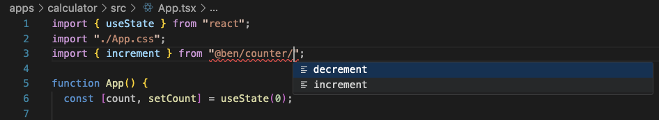
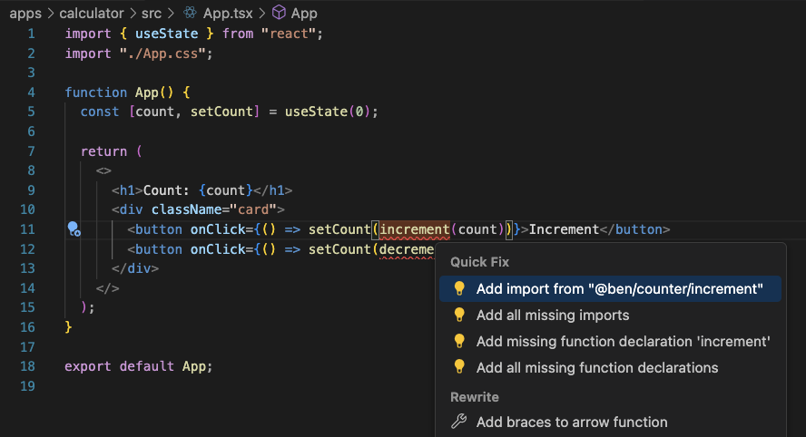

# Create reusable javascript packages with workspaces

Workspaces are a great way to create modular reusable code in the javascript ecosystem. npm will automatically link packages in the node_modules folder. Previously you had to manually do that via [npm link](https://docs.npmjs.com/cli/v10/commands/npm-link). Workspaces enable multiple projects in a single repository creating a [mono repository](https://monorepo.tools/).

Modular packages means your code is better organized, smaller, easier to test, and has fewer dependencies. Let's create a simple demo that uses npm workspaces.

Let's start by adding our workspaces to a **package.json** at the root of the project directory. We'll have a directory for packages and a directory for applications.

::: code-group

```json [package.json]
{
  "name": "workspaces",
  "workspaces": ["packages/*", "apps/*"]
}
```

:::

Let's create our first package called counter in a packages directory.

```shellsession
$ mkdir packages
$ mkdir packages/counter
$ cd packages/counter

$ npm init --scope=@ben --yes
Wrote to /workspaces/packages/counter/package.json:
{
  "name": "@ben/counter",
  "version": "1.0.0",
  "main": "index.js",
  "scripts": {
    "test": "echo \"Error: no test specified\" && exit 1"
  },
  "keywords": [],
  "author": "",
  "license": "ISC",
  "description": ""
}
```

[Scope](https://docs.npmjs.com/cli/v10/using-npm/scope) is a way of grouping related packages together. A lot **npm** and **pnpm** features give you the ability to execute commands across scoped packages.

Next, let's add typescript as a dev dependency and initialize it.

```shellsession
$ npm i -D typescript
added 1 package, and audited 202 packages in 604ms

41 packages are looking for funding
  run `npm fund` for details

found 0 vulnerabilities

$ npx tsc --init
Created a new tsconfig.json with:

  target: es2016
  module: commonjs
  strict: true
  esModuleInterop: true
  skipLibCheck: true
  forceConsistentCasingInFileNames: true

You can learn more at https://aka.ms/tsconfig
```

Let's add some source code.

```shellsession
$ mkdir src
$ touch src/increment.ts
$ touch src/decrement.ts
```

::: code-group

```ts [increment.ts]
const increment = (a: number): number => a + 1;

export { increment };
```

```ts [decrement.ts]
const decrement = (a: number): number => a - 1;

export { decrement };
```

:::

Next let's update our exports field in the package.json file to specify our entrypoints for the counter package. Being explicit with package exports will give your code editor better auto-completion and prevent [/blog/what-is-a-barrel-file](barrel files).

```json
{
  "name": "@ben/counter",
  "exports": {
    "./increment": {
      "default": "./src/increment.ts"
    },
    "./decrement": {
      "default": "./src/decrement.ts"
    }
  },
  "devDependencies": {
    "typescript": "^5.6.2"
  }
}
```

Let's create an app called calculator.

```shellsession
mkdir apps
cd apps
npm create vite@latest calculator -- --template react-ts

> npx
> create-vite calculator --template react-ts


Scaffolding project in /workspaces/apps/calculator...

Done. Now run:

  cd test
  npm install
  npm run dev

```

let's add the **@ben/counter** package as a dependency

```shellsession
$ cd calculator
$ npm i @ben/counter

up to date, audited 202 packages in 595ms

41 packages are looking for funding
  run `npm fund` for details

found 0 vulnerabilities

```

We can verify the package has been added

::: code-group

```json [apps/calculator/package.json]
  "dependencies": {
    "@ben/counter": "*", // [!code ++]
    "react": "^18.3.1",
    "react-dom": "^18.3.1"
  },
```

:::

Replace the vite template boilerplate code with:

::: code-group

```tsx [apps/calculator/src/App.tsx]
import { useState } from "react";
import "./App.css";
import { increment } from "@ben/counter/increment";
import { decrement } from "@ben/counter/decrement";

function App() {
  const [count, setCount] = useState(0);

  return (
    <>
      <h1>Count: {count}</h1>
      <div className="card">
        <button onClick={() => setCount(increment(count))}>Increment</button>
        <button onClick={() => setCount(decrement(count))}>Decrement</button>
      </div>
    </>
  );
}

export default App;
```

:::

Not only can we use the **@ben/counter** package but we also get intellisense.





Let's verify it works

<video src="../assets/videos/ben-counter-npm-workspaces.mp4" controls autoplay />
